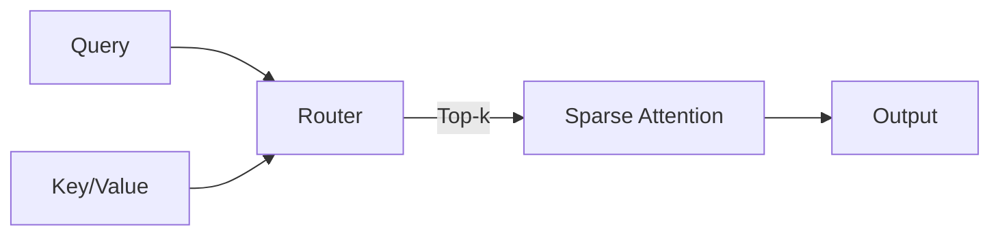
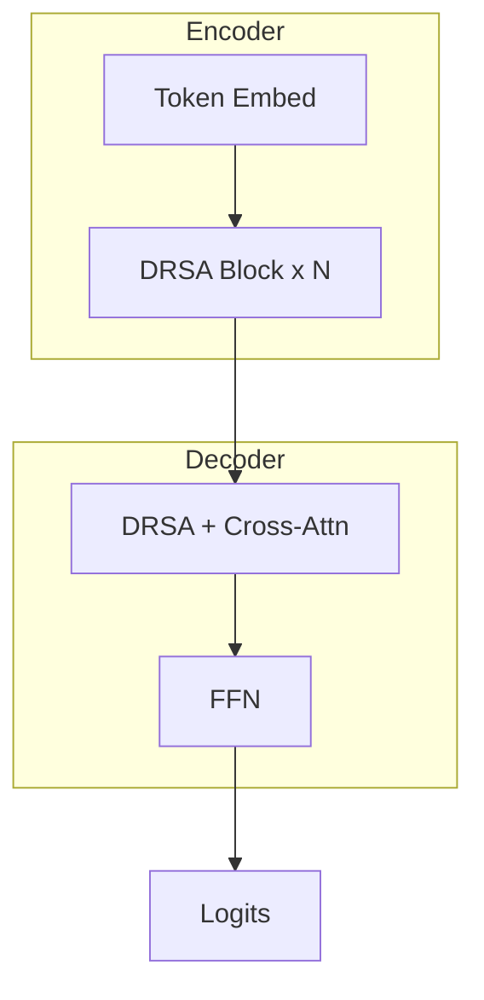

## Background
<!-- layout: standard -->

- 长上下文场景对注意力机制提出新挑战
- 全注意力计算复杂度 \(O(n^2)\)，显存压力显著
- 现有稀疏方法在精度与效率间难以兼顾

---

## Method Overview
<!-- layout: two-column -->

我们提出一种基于动态路由的稀疏注意力（DRSA）：

- 在每个解码步动态选择 Top-k 关键 token
- 通过低秩近似估计 token 重要性
- 与 KV-Cache 压缩协同优化

---

## Architecture
<!-- layout: image -->

---

## Experimental Setup
<!-- layout: standard -->

- **Datasets**: PG-19, LongBench, ZeroSCROLLS
- **Backbones**: LLaMA-2-7B, Mistral-7B
- **Baselines**: Full Attention, Longformer, BigBird, StreamingLLM
- **Hardware**: 8 × A100 80GB

---

## Results

| Method        | Acc ↑  | Latency (ms) ↓ | Mem (GB) ↓ |
|---------------|--------|----------------|------------|
| Full Attn     | 0.812  | 612            | 38.4       |
| Longformer    | 0.798  | 224            | 14.1       |
| BigBird       | 0.803  | 251            | 16.7       |
| StreamingLLM  | 0.789  | 198            | 12.2       |
| **DRSA (Ours)** | **0.821** | **187**     | **11.8**   |

---

## Conclusion
<!-- layout: summary -->

- DRSA 在 5 个长文本任务上同时改善精度与效率
- 与现有 KV-Cache 优化方法正交，可叠加使用
- 代码与权重将开源于 GitHub
